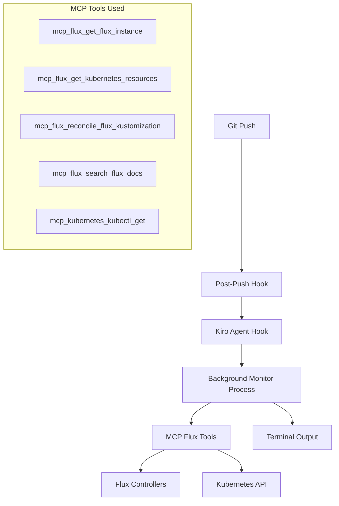
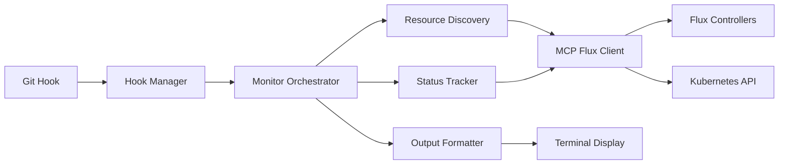

# Design Document

## Overview

The Git Flux Reconciliation Monitor is a Kiro agent hook that automatically monitors Flux reconciliation status after git pushes. It integrates deeply with the MCP Flux tooling to provide real-time feedback on GitOps deployments, helping developers understand the immediate impact of their changes on the Kubernetes cluster.

The system operates as a post-push git hook that spawns a background monitoring process, leveraging Kiro's agent execution framework and MCP tools to query Flux resources and display structured status information.

## Architecture

### High-Level Architecture



### Component Architecture



## Components and Interfaces

### 1. Git Hook Integration

**Purpose**: Seamlessly integrate with git workflow without blocking pushes

**Interface**:
```bash
# Post-push hook entry point
.git/hooks/post-push -> kiro-flux-monitor
```

**Key Design Decisions**:
- Uses post-push hook to trigger monitoring after changes reach the remote repository
- Spawns background process immediately after push completes
- Provides immediate feedback while allowing git workflow to continue
- Only triggers when pushing to branches that Flux monitors (typically main/master)
- Includes branch and remote information in monitoring context

### 2. Kiro Agent Hook

**Purpose**: Leverage Kiro's agent execution framework for MCP tool access

**Configuration**:
```yaml
# .kiro/hooks/flux-reconciliation-monitor.yaml
name: "Flux Reconciliation Monitor"
trigger: "post-push"
description: "Monitor Flux reconciliation after git pushes"
enabled: true
config:
  timeout: 300
  verbosity: "normal"
  monitor_types: ["kustomizations", "helmreleases"]
```

**Interface**:
- Integrates with Kiro's hook system
- Accesses MCP tools through agent execution context
- Handles configuration and lifecycle management

### 3. Monitor Orchestrator

**Purpose**: Coordinate the monitoring workflow and manage the monitoring lifecycle

**Key Responsibilities**:
- Initialize monitoring session
- Coordinate resource discovery and tracking
- Manage timeout and cancellation
- Handle error scenarios gracefully

**Interface**:
```python
class MonitorOrchestrator:
    def __init__(self, config: MonitorConfig, mcp_client: MCPFluxClient)
    def start_monitoring(self) -> MonitorSession
    def stop_monitoring(self, session_id: str)
    def get_status(self, session_id: str) -> MonitorStatus
```

### 4. Resource Discovery Engine

**Purpose**: Identify relevant Flux resources that may be affected by the commit

**MCP Integration**:
```python
# Discover Kustomizations
kustomizations = mcp_flux_get_kubernetes_resources(
    apiVersion="kustomize.toolkit.fluxcd.io/v1",
    kind="Kustomization"
)

# Discover HelmReleases  
helmreleases = mcp_flux_get_kubernetes_resources(
    apiVersion="helm.toolkit.fluxcd.io/v2",
    kind="HelmRelease"
)
```

**Discovery Strategy**:
1. Query all Kustomizations and HelmReleases
2. Analyze dependency chains using `dependsOn` fields
3. Prioritize resources likely to be affected by recent changes
4. Build monitoring plan based on dependencies

### 5. Status Tracking Engine

**Purpose**: Monitor resource reconciliation status in real-time

**Tracking Loop**:
```python
async def track_reconciliation_status():
    while not timeout_reached():
        for resource in monitored_resources:
            current_status = await mcp_flux_get_kubernetes_resources(
                apiVersion=resource.api_version,
                kind=resource.kind,
                name=resource.name,
                namespace=resource.namespace
            )
            
            status_change = analyze_status_change(resource, current_status)
            if status_change:
                emit_status_update(status_change)
        
        await asyncio.sleep(polling_interval)
```

**Status Analysis**:
- Parse resource conditions and status fields
- Detect state transitions (Progressing → Ready → Failed)
- Extract error messages and diagnostic information
- Track reconciliation timing and performance

### 6. Output Formatter

**Purpose**: Present monitoring information in a clear, actionable format

**Output Modes**:
- **Real-time**: Live updates during monitoring
- **Summary**: Final status when monitoring completes
- **Error**: Detailed error information when failures occur

**Format Example**:
```
🔄 Flux Reconciliation Monitor
📊 Monitoring 4 resources after push abc123f → origin/main

┌─ infrastructure-core (Kustomization)
│  ✅ Ready - Applied 12 resources (2.3s)
│
├─ infrastructure-storage (Kustomization) 
│  🔄 Progressing - Waiting for dependencies (15s)
│  └─ Depends on: infrastructure-core ✅
│
├─ monitoring-core (HelmRelease)
│  ❌ Failed - Validation error in values
│  └─ Error: values.yaml: field 'storageClass' is required
│
└─ example-app-dev (Kustomization)
    ⏳ Pending - Waiting for reconciliation

📈 Summary: 1 ready, 1 progressing, 1 failed, 1 pending
```

## Data Models

### MonitorConfig

```python
@dataclass
class MonitorConfig:
    timeout: int = 300  # seconds
    polling_interval: int = 2  # seconds
    verbosity: str = "normal"  # minimal, normal, verbose
    monitor_types: List[str] = field(default_factory=lambda: ["kustomizations", "helmreleases"])
    show_dependencies: bool = True
    auto_reconcile: bool = False  # trigger reconciliation if needed
```

### ResourceStatus

```python
@dataclass
class ResourceStatus:
    name: str
    namespace: str
    kind: str
    api_version: str
    phase: str  # Pending, Progressing, Ready, Failed
    conditions: List[Dict]
    last_reconcile_time: Optional[datetime]
    error_message: Optional[str]
    dependencies: List[str]
    reconciliation_duration: Optional[float]
```

### MonitorSession

```python
@dataclass
class MonitorSession:
    session_id: str
    start_time: datetime
    commit_hash: str
    branch: str
    remote: str
    monitored_resources: List[ResourceStatus]
    status: str  # active, completed, failed, cancelled
    config: MonitorConfig
```

## Error Handling

### Error Categories

1. **Cluster Connectivity Errors**
   - Use `mcp_flux_get_flux_instance` to verify cluster access
   - Graceful degradation with informative messages
   - Retry logic with exponential backoff

2. **Flux Controller Errors**
   - Parse error conditions from MCP resource responses
   - Use `mcp_flux_search_flux_docs` for contextual help
   - Categorize errors by severity and actionability

3. **Resource Not Found Errors**
   - Handle cases where expected resources don't exist
   - Provide suggestions for common misconfigurations
   - Guide users to check resource names and namespaces

4. **Timeout Scenarios**
   - Configurable timeout values
   - Partial status reporting when timeout occurs
   - Option to continue monitoring in background

### Error Recovery Strategies

```python
async def handle_mcp_error(error: MCPError, resource: ResourceStatus):
    if error.type == "connection_error":
        return await retry_with_backoff(lambda: query_resource(resource))
    elif error.type == "not_found":
        return await suggest_alternatives(resource)
    elif error.type == "permission_denied":
        return await check_rbac_permissions(resource)
    else:
        return await log_and_continue(error, resource)
```

## Testing Strategy

### Unit Testing

1. **MCP Tool Integration Tests**
   - Mock MCP responses for different resource states
   - Test error handling for various MCP failure scenarios
   - Verify correct MCP tool selection and parameter passing

2. **Status Analysis Tests**
   - Test parsing of Flux resource conditions
   - Verify dependency chain analysis
   - Test state transition detection

3. **Output Formatting Tests**
   - Test different verbosity levels
   - Verify terminal formatting and colors
   - Test output for various resource states

### Integration Testing

1. **End-to-End Workflow Tests**
   - Test complete git push → monitoring → output workflow
   - Verify integration with Kiro agent hook system
   - Test configuration loading and validation

2. **Real Cluster Tests**
   - Test against actual Flux resources in development cluster
   - Verify MCP tool integration with real Flux controllers
   - Test timeout and cancellation scenarios

3. **Performance Tests**
   - Test monitoring performance with large numbers of resources
   - Verify polling efficiency and resource usage
   - Test concurrent monitoring sessions

### Test Scenarios

```python
# Test cases for different Flux states
test_scenarios = [
    "successful_reconciliation",
    "failed_validation",
    "dependency_waiting", 
    "timeout_scenario",
    "cluster_unreachable",
    "flux_controllers_down",
    "mixed_success_failure",
    "rapid_successive_pushes"
]
```

## Implementation Considerations

### Performance Optimization

1. **Efficient Polling**
   - Adaptive polling intervals based on resource state
   - Batch MCP queries where possible
   - Cache resource metadata to reduce API calls

2. **Resource Filtering**
   - Only monitor resources likely to be affected by changes
   - Use git diff analysis to predict impacted resources
   - Implement smart dependency tracking

3. **Background Processing**
   - Non-blocking execution after git push
   - Efficient process management and cleanup
   - Resource cleanup on cancellation

### Security Considerations

1. **Credential Management**
   - Leverage existing kubeconfig and MCP authentication
   - No additional credential storage required
   - Respect existing RBAC permissions

2. **Information Disclosure**
   - Sanitize sensitive information in output
   - Respect namespace-based access controls
   - Avoid logging sensitive resource data

### Extensibility

1. **Plugin Architecture**
   - Support for custom resource types beyond Kustomizations/HelmReleases
   - Pluggable output formatters
   - Custom status analysis rules

2. **Integration Points**
   - Webhook support for external notifications
   - Integration with CI/CD systems
   - Export monitoring data for external analysis

## Future Enhancements

### Phase 2 Features

1. **Predictive Analysis**
   - Analyze git changes to predict which resources will be affected
   - Pre-validate changes before reconciliation
   - Suggest potential issues based on change patterns

2. **Advanced Notifications**
   - Slack/Teams integration for team notifications
   - Email alerts for critical failures
   - Integration with existing monitoring systems

3. **Historical Analysis**
   - Track reconciliation performance over time
   - Identify patterns in failures and successes
   - Generate reports on GitOps deployment health

### Integration Opportunities

1. **IDE Integration**
   - VS Code extension for in-editor monitoring
   - Real-time status in git push interfaces
   - Integration with existing GitOps workflows

2. **CI/CD Integration**
   - GitHub Actions integration for PR validation
   - Automated rollback on reconciliation failures
   - Integration with deployment pipelines