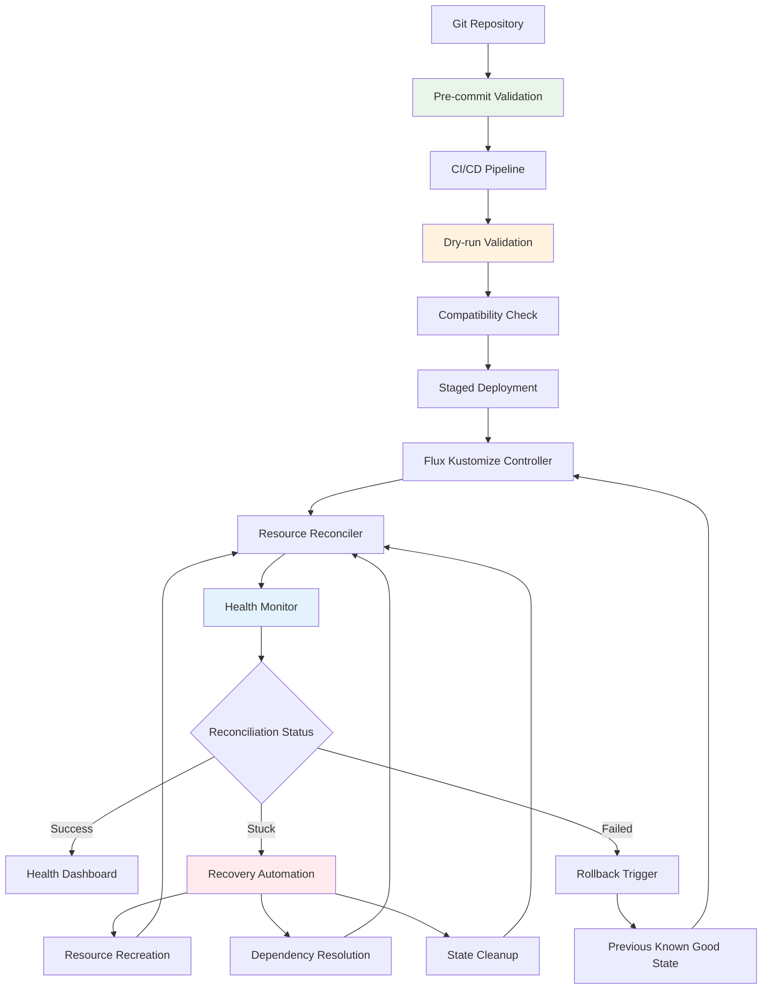

# Design Document

## Overview

This design establishes resilient GitOps patterns that prevent infrastructure lock-ups, automate recovery from stuck states, and ensure smooth infrastructure evolution. The approach focuses on proactive conflict prevention, automated recovery mechanisms, and robust validation pipelines that maintain system stability while enabling continuous deployment.

## Architecture

### Current Problem Analysis

The infrastructure lock-up occurs due to several systemic issues:

1. **Immutable Field Conflicts**: Kubernetes resources with immutable fields (like Deployment selectors) cannot be updated in-place
2. **Label Propagation Issues**: Kustomize commonLabels applied to existing resources cause selector mismatches
3. **Resource Interdependencies**: Complex dependency chains where one stuck resource blocks entire kustomizations
4. **Lack of Recovery Automation**: Manual intervention required for stuck reconciliation states
5. **Insufficient Validation**: Changes applied without pre-validation of compatibility

### Target Architecture



## Components and Interfaces

### 1. Pre-commit Validation System

**Purpose**: Catch breaking changes before they reach the cluster

**Design Decisions**:
- Git pre-commit hooks for kustomization validation
- Immutable field change detection
- Resource compatibility analysis

**Interface**:
```bash
# Pre-commit hook script
#!/bin/bash
set -e

echo "Validating kustomization builds..."
for kustomization in $(find . -name "kustomization.yaml" -not -path "./.git/*"); do
    dir=$(dirname "$kustomization")
    echo "Building $dir..."
    kubectl kustomize "$dir" > /dev/null || exit 1
done

echo "Checking for immutable field changes..."
./scripts/check-immutable-fields.sh || exit 1

echo "Validation passed!"
```

### 2. Resource Lifecycle Manager

**Purpose**: Handle resource updates with immutable field considerations

**Design Decisions**:
- Blue-green deployment for resources with immutable fields
- Atomic resource replacement strategies
- Dependency-aware update ordering

**Interface**:
```yaml
# Resource update strategy annotation
apiVersion: apps/v1
kind: Deployment
metadata:
  name: example-deployment
  annotations:
    flux.weave.works/update-strategy: "recreate"
    flux.weave.works/dependency-order: "2"
spec:
  # deployment spec
```

### 3. Reconciliation Health Monitor

**Purpose**: Detect stuck reconciliation states and trigger recovery

**Design Decisions**:
- Prometheus metrics for reconciliation timing
- Alert rules for stuck kustomizations
- Automated recovery trigger thresholds

**Interface**:
```yaml
# Monitoring configuration
apiVersion: monitoring.coreos.com/v1
kind: PrometheusRule
metadata:
  name: flux-reconciliation-health
spec:
  groups:
  - name: flux.reconciliation
    rules:
    - alert: FluxKustomizationStuck
      expr: |
        (time() - flux_kustomization_last_applied_revision_timestamp) > 300
        and flux_kustomization_ready == 0
      for: 2m
      labels:
        severity: warning
      annotations:
        summary: "Flux kustomization {{ $labels.name }} stuck for > 5 minutes"
        description: "Kustomization {{ $labels.name }} in namespace {{ $labels.namespace }} has been stuck for more than 5 minutes"
```

### 4. Automated Recovery System

**Purpose**: Automatically resolve common stuck states

**Design Decisions**:
- Pattern-based error detection and resolution for both Kustomizations and HelmReleases
- Resource recreation with proper cleanup
- Dependency chain resolution
- HelmRelease-specific rollback procedures

**Interface**:
```yaml
# Recovery automation configuration
apiVersion: v1
kind: ConfigMap
metadata:
  name: flux-recovery-config
data:
  recovery-patterns.yaml: |
    patterns:
    - error_pattern: "field is immutable"
      recovery_action: "recreate_resource"
      max_retries: 3
      applies_to: ["Deployment", "Service", "StatefulSet"]
    - error_pattern: "dry-run failed.*Invalid.*spec.selector"
      recovery_action: "recreate_deployment"
      cleanup_dependencies: true
    - error_pattern: "HelmRelease.*failed.*upgrade"
      recovery_action: "rollback_helm_release"
      max_retries: 2
      validation_required: true
    - error_pattern: "install retries exhausted"
      recovery_action: "reset_helm_release"
      cleanup_dependencies: true
```

### 5. Staged Deployment Controller

**Purpose**: Implement safe, staged rollout of infrastructure changes

**Design Decisions**:
- Canary deployment patterns for infrastructure
- Validation gates between stages
- Automatic rollback on failure

**Interface**:
```yaml
# Staged deployment configuration
apiVersion: flux.weave.works/v1
kind: StagedKustomization
metadata:
  name: infrastructure-staged
spec:
  stages:
  - name: validation
    kustomizationRef:
      name: infrastructure-dry-run
    validationChecks:
    - type: build-success
    - type: compatibility-check
  - name: deployment
    kustomizationRef:
      name: infrastructure
    dependsOn:
    - validation
    healthChecks:
    - type: pod-ready
      timeout: 300s
```

## Data Models

### Reconciliation State Tracking
```yaml
apiVersion: v1
kind: ConfigMap
metadata:
  name: reconciliation-state
data:
  last-successful-revision: "main@sha1:abc123"
  last-attempt-timestamp: "2024-01-15T10:30:00Z"
  failure-count: "0"
  recovery-attempts: "0"
  health-status: "healthy"
```

### Resource Update Strategy
```yaml
# Annotation-based strategy definition
metadata:
  annotations:
    gitops.flux.io/update-strategy: "blue-green|rolling|recreate"
    gitops.flux.io/immutable-fields: "spec.selector,spec.clusterIP"
    gitops.flux.io/dependency-weight: "10"
    gitops.flux.io/recovery-policy: "auto|manual"
```

## Error Handling

### Immutable Field Conflict Resolution

1. **Detection**: Parse Kubernetes API errors for immutable field patterns
2. **Analysis**: Identify affected resources and dependencies
3. **Strategy Selection**: Choose appropriate resolution (recreate, blue-green, etc.)
4. **Execution**: Implement resolution with proper cleanup and validation
5. **Verification**: Confirm successful resolution and system health

### Stuck Reconciliation Recovery

1. **Monitoring**: Continuous tracking of reconciliation timing and status
2. **Threshold Detection**: Identify when reconciliation exceeds normal timeframes
3. **Pattern Analysis**: Classify the type of stuck state based on error patterns
4. **Automated Resolution**: Apply appropriate recovery procedures
5. **Escalation**: Manual intervention triggers if automation fails

### Dependency Chain Resolution

1. **Dependency Mapping**: Maintain graph of resource dependencies
2. **Impact Analysis**: Determine cascade effects of resource changes
3. **Ordered Resolution**: Resolve conflicts in dependency order
4. **State Consistency**: Ensure consistent state throughout resolution process

## Testing Strategy

### Pre-deployment Validation
- Kustomization build testing in CI/CD
- Resource compatibility validation
- Immutable field change detection
- Dependency impact analysis

### Chaos Engineering
- Intentional introduction of stuck states
- Recovery procedure validation
- System resilience testing
- Performance under failure conditions

### Integration Testing
- End-to-end reconciliation scenarios
- Multi-component update testing
- Rollback procedure validation
- Cross-dependency update testing

## Implementation Phases

### Phase 1: Prevention Infrastructure
- Implement pre-commit validation hooks
- Create resource compatibility checking tools
- Establish monitoring and alerting for reconciliation health
- Document emergency recovery procedures

### Phase 2: Automated Recovery
- Build reconciliation health monitoring
- Implement pattern-based recovery automation
- Create resource lifecycle management tools
- Establish rollback automation

### Phase 3: Advanced Resilience
- Implement staged deployment patterns
- Build dependency-aware update orchestration
- Create chaos engineering test suite
- Establish continuous resilience validation

### Phase 4: Operational Excellence
- Comprehensive monitoring dashboards
- Automated incident response
- Continuous improvement feedback loops
- Knowledge base and runbook automation