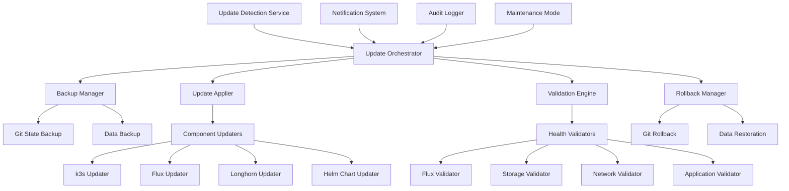

# Design Document

## Overview

The GitOps Update Management System provides a comprehensive solution for managing updates across the k3s cluster infrastructure. The system follows GitOps principles by using Git as the source of truth for all changes, while providing automated tooling for safe update application, validation, and rollback procedures.

The design emphasizes safety-first approaches with extensive validation, backup procedures, and automatic rollback capabilities. All operations are logged and auditable, maintaining the security and reliability standards expected in a production environment.

## Architecture

### System Components



### Data Flow

1. **Detection Phase**: Scan for available updates across all components
2. **Planning Phase**: Analyze impact and create update plan with dependency ordering
3. **Backup Phase**: Create comprehensive backups of current state
4. **Update Phase**: Apply updates following dependency hierarchy
5. **Validation Phase**: Run comprehensive tests to verify system health
6. **Completion Phase**: Generate reports and notifications

## Components and Interfaces

### Update Detection Service

**Purpose**: Continuously monitor for available updates across all cluster components

**Interface**:
```bash
# Main detection script
./scripts/detect-updates.sh [--component <name>] [--format json|yaml|text]

# Component-specific detection
./scripts/detect-k3s-updates.sh
./scripts/detect-flux-updates.sh
./scripts/detect-longhorn-updates.sh
./scripts/detect-helm-updates.sh
```

**Configuration**:
```yaml
# config/update-detection.yaml
detection:
  schedule: "0 6 * * *"  # Daily at 6 AM
  components:
    k3s:
      channel: "stable"
      check_interval: "24h"
    flux:
      repository: "fluxcd/flux2"
      check_prereleases: false
    longhorn:
      repository: "longhorn/longhorn"
      minimum_version: "1.9.0"
  notifications:
    critical_updates: true
    regular_updates: false
```

**Enhanced Implementation Features (Task 1.6)**:
- **Standardized API Client**: Consistent timeout and retry logic across all detection scripts following steering guidelines
- **Centralized Configuration**: Unified configuration management for all detection components
- **Response Validation**: Sanitization and validation of external API responses
- **Standardized Logging**: Color-coded logging patterns using approved format from steering guidelines
- **Error Handling**: Proper module sourcing with error checking for shared libraries
- **Resource Cleanup**: Trap handlers for proper resource cleanup on script exit
- **Architecture Awareness**: k3s architecture-specific version detection logic
- **Safe Arithmetic**: Defensive programming patterns for version comparison operations

### Update Orchestrator

**Purpose**: Coordinate the entire update process with proper sequencing and error handling

**Interface**:
```bash
# Main orchestration script
./scripts/update-orchestrator.sh [--dry-run] [--component <name>] [--maintenance-window]

# Maintenance mode control
./scripts/maintenance-mode.sh [enable|disable|status]
```

**State Management**:
- Tracks current update progress in `/tmp/update-state.json`
- Maintains update history in `logs/update-history/`
- Stores rollback points for each successful stage

### Backup Manager

**Purpose**: Create comprehensive backups before any update operations

**Components**:
- **Git State Backup**: Records current commit hashes and branch states
- **Configuration Backup**: Backs up critical ConfigMaps and Secrets
- **Data Backup**: Creates snapshots of persistent volumes (Longhorn)
- **Cluster State Backup**: Exports current resource definitions

**Interface**:
```bash
# Create full backup
./scripts/create-update-backup.sh --backup-id <timestamp>

# Restore from backup
./scripts/restore-from-backup.sh --backup-id <timestamp>

# List available backups
./scripts/list-backups.sh
```

### Component Updaters

**Purpose**: Handle updates for specific infrastructure components

#### k3s Updater
- Downloads and installs k3s binary updates
- Handles node-by-node rolling updates for multi-node clusters
- Validates cluster connectivity after each node update

#### Flux Updater
- Updates Flux controllers via Helm or manifests
- Handles CRD updates and controller reconciliation
- Validates GitOps functionality post-update

#### Longhorn Updater
- Manages Longhorn storage system updates
- Handles volume migration and data preservation
- Validates storage functionality with test workloads

#### Helm Chart Updater
- Updates Helm releases across all namespaces
- Handles dependency resolution and value preservation
- Validates application functionality post-update

### Validation Engine

**Purpose**: Comprehensive testing to ensure system health after updates

**Validation Categories**:

1. **Infrastructure Validation**:
   - Node health and resource availability
   - Network connectivity between nodes
   - DNS resolution and service discovery

2. **Flux Validation**:
   - Controller pod health and reconciliation
   - GitRepository and Kustomization sync status
   - HelmRelease deployment success

3. **Storage Validation**:
   - Longhorn volume creation and mounting
   - Data persistence and replication
   - Backup and restore functionality

4. **Application Validation**:
   - Pod health and readiness checks
   - Service endpoint availability
   - Ingress routing functionality

**Interface**:
```bash
# Run all validations
./scripts/validate-cluster-health.sh [--post-update] [--component <name>]

# Component-specific validation
./scripts/validate-flux.sh
./scripts/validate-storage.sh
./scripts/validate-networking.sh
./scripts/validate-applications.sh
```

### Rollback Manager

**Purpose**: Automated rollback procedures for failed updates

**Rollback Strategies**:

1. **Git-based Rollback**: Revert to previous commit and reconcile
2. **Component Rollback**: Downgrade specific components while preserving data
3. **Full System Rollback**: Complete restoration from backup point
4. **Emergency Recovery**: Manual procedures for critical failures

**Interface**:
```bash
# Automatic rollback (triggered by validation failures)
./scripts/auto-rollback.sh --backup-id <timestamp>

# Manual rollback
./scripts/manual-rollback.sh --component <name> --target-version <version>

# Emergency recovery
./scripts/emergency-recovery.sh --restore-from-backup <backup-id>
```

## Data Models

### Update Report Structure
```yaml
update_report:
  timestamp: "2025-02-08T10:00:00Z"
  scan_duration: "45s"
  components:
    k3s:
      current_version: "v1.28.5+k3s1"
      available_version: "v1.28.7+k3s1"
      update_type: "patch"
      security_update: false
      changelog_url: "https://github.com/k3s-io/k3s/releases/tag/v1.28.7+k3s1"
    flux:
      current_version: "v2.6.0"
      available_version: "v2.7.1"
      update_type: "minor"
      security_update: true
      breaking_changes: []
  summary:
    total_updates: 4
    security_updates: 1
    breaking_changes: 0
    recommended_action: "schedule_maintenance"
```

### Update State Tracking
```yaml
update_state:
  update_id: "update-20250208-100000"
  status: "in_progress"
  started_at: "2025-02-08T10:00:00Z"
  current_phase: "updating_flux"
  completed_phases:
    - "backup_creation"
    - "pre_update_validation"
    - "k3s_update"
  backup_id: "backup-20250208-095500"
  rollback_points:
    - phase: "k3s_update"
      git_commit: "abc123def456"
      timestamp: "2025-02-08T10:15:00Z"
```

## Error Handling

### Failure Categories

1. **Pre-Update Failures**:
   - Cluster health check failures
   - Backup creation failures
   - Network connectivity issues

2. **Update Failures**:
   - Component update failures
   - Reconciliation timeouts
   - Resource conflicts

3. **Post-Update Failures**:
   - Validation test failures
   - Application health issues
   - Data corruption detection

### Recovery Procedures

**Automatic Recovery**:
- Validation failures trigger immediate rollback
- Component-specific failures attempt targeted recovery
- Network issues trigger retry with exponential backoff

**Manual Recovery**:
- Emergency recovery scripts for critical failures
- Step-by-step troubleshooting guides
- Contact procedures for escalation

## Testing Strategy

### Pre-Deployment Testing

1. **Unit Tests**: Individual component updater validation
2. **Integration Tests**: End-to-end update workflow testing
3. **Chaos Testing**: Failure injection during update processes
4. **Performance Tests**: Update time and resource usage validation

### Validation Test Suite

1. **Smoke Tests**: Basic functionality verification
2. **Regression Tests**: Ensure existing functionality remains intact
3. **Load Tests**: Verify performance under normal workloads
4. **Security Tests**: Validate security configurations post-update

### Test Environment

- Dedicated test cluster mirroring production configuration
- Automated test execution with CI/CD integration
- Test data generation and cleanup procedures
- Performance baseline establishment and comparison

## Implementation Phases

### Phase 1: Core Infrastructure
- Update detection service implementation
- Basic backup and restore functionality
- Git-based rollback procedures

### Phase 2: Component Updaters
- k3s updater with rolling update support
- Flux updater with CRD handling
- Longhorn updater with data preservation

### Phase 3: Validation and Safety
- Comprehensive validation engine
- Automated rollback triggers
- Emergency recovery procedures

### Phase 4: Automation and Scheduling
- Maintenance window management
- Automated update scheduling
- Notification and reporting systems

### Phase 5: Advanced Features
- Impact analysis and dependency mapping
- Performance optimization
- Multi-cluster update coordination