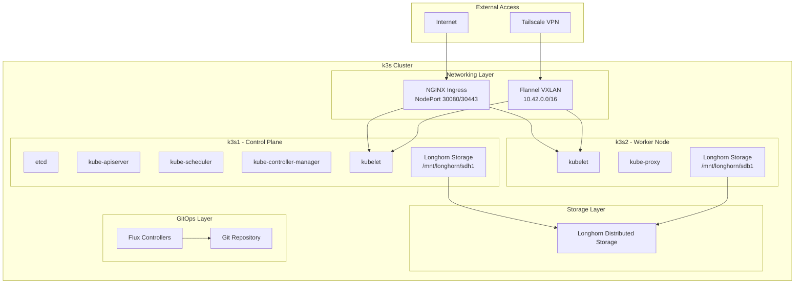
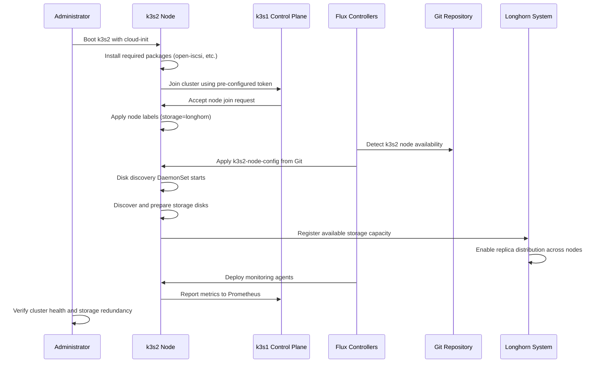

# Design Document: k3s2 Node Onboarding

## Overview

This design document outlines the comprehensive approach for onboarding the k3s2 node to the existing k3s cluster. The design maintains the bulletproof architecture principles where core infrastructure (networking, ingress) remains operational even during storage system failures. The onboarding process leverages existing GitOps patterns, automated disk discovery, and declarative configuration management.

### Current State Analysis

**Existing Infrastructure:**
- k3s1: Primary control plane node (192.168.86.71) with Longhorn storage on `/mnt/longhorn/sdh1`
- Flux GitOps: Managing infrastructure and applications declaratively
- Bulletproof Architecture: Core services independent of storage layer
- Monitoring: Prometheus/Grafana stack with hybrid monitoring approach
- Networking: Flannel VXLAN overlay with NGINX Ingress on NodePorts (30080/30443)
- Security: SOPS-encrypted secrets, Tailscale VPN access

**Prepared Components:**
- k3s2 node configuration already exists in `infrastructure/k3s2-node-config/`
- Cloud-init configuration prepared for automated k3s installation
- Disk discovery DaemonSet ready for multi-node storage detection
- Monitoring system configured for multi-node metrics collection

## Architecture

### Multi-Node Cluster Architecture



### Node Onboarding Flow



## Components and Interfaces

### 1. Node Bootstrap System

**Cloud-Init Configuration:**
- Location: `infrastructure/cloud-init/user-data.k3s2`
- Purpose: Automated k3s installation and initial node configuration
- Key Components:
  - Package installation (open-iscsi, jq, curl, wget)
  - k3s agent installation with cluster join parameters
  - Node labeling for Longhorn participation
  - iSCSI daemon enablement for storage connectivity

**Bootstrap Parameters:**
```yaml
K3S_URL: https://192.168.86.71:6443
K3S_TOKEN: [SOPS-encrypted cluster token]
Node Labels:
  - node.longhorn.io/create-default-disk=config
  - storage=longhorn
```

### 2. Storage Discovery and Configuration

**Disk Discovery DaemonSet:**
- Location: `infrastructure/storage/disk-discovery-daemonset.yaml`
- Functionality:
  - Automatic detection of unmounted disks >10GB
  - Partition creation and filesystem formatting
  - Mount point creation at `/mnt/longhorn/<disk_name>`
  - Longhorn disk configuration file creation

**Node-Specific Storage Configuration:**
- Location: `infrastructure/k3s2-node-config/k3s2-node.yaml`
- Longhorn Node CRD defining:
  - Disk path: `/mnt/longhorn/sdb1`
  - Storage scheduling: enabled
  - Storage reservation: 0 (use all available space)

### 3. GitOps Integration

**Flux Kustomization Structure:**
```yaml
infrastructure-storage:
  path: ./infrastructure/storage
  includes:
    - longhorn/base/
    - disk-discovery-daemonset.yaml
    - k3s1-node-config/
    - k3s2-node-config/  # Activated when k3s2 joins
```

**Conditional Resource Activation:**
- k3s2 configuration currently commented out in `infrastructure/storage/kustomization.yaml`
- Activation triggered by uncommenting the k3s2-node-config reference
- Flux automatically applies configuration when node becomes available

### 4. Networking Integration

**Flannel VXLAN Configuration:**
- Pod CIDR: 10.42.0.0/16 (distributed across nodes)
- Service CIDR: 10.43.0.0/16
- VXLAN backend for overlay networking between nodes
- Automatic route distribution and network policy enforcement

**Ingress Load Balancing:**
- NGINX Ingress Controller deployed as DaemonSet
- NodePort services on both nodes (30080/30443)
- Automatic backend discovery and load balancing
- Health checks ensure traffic only routes to healthy nodes

**Tailscale VPN Integration:**
- Subnet router advertises both node networks
- Routes: 10.42.0.0/16 (pods), 10.43.0.0/16 (services)
- Secure access to cluster resources from external networks
- Device-level authentication and encryption

### 5. Monitoring and Observability

**Node-Level Monitoring:**
- Prometheus node-exporter deployed via DaemonSet
- Automatic metric collection from k3s2 when it joins
- Node-specific metrics: CPU, memory, disk, network
- Integration with existing Grafana dashboards

**Flux Controller Monitoring:**
- Hybrid ServiceMonitor/PodMonitor approach
- Controllers with services: source-controller, notification-controller
- Controllers without services: kustomize-controller, helm-controller
- Metrics endpoint: port 8080, path `/metrics`

**Longhorn Storage Monitoring:**
- Volume health and replica distribution metrics
- Node storage capacity and utilization
- Backup and snapshot status monitoring
- Integration with alerting for storage failures

## Data Models

### Node Configuration Model

```yaml
apiVersion: longhorn.io/v1beta2
kind: Node
metadata:
  name: k3s2
  namespace: longhorn-system
  annotations:
    node.longhorn.io/paths: "/mnt/longhorn/sdb1"
spec:
  disks:
    sdb1:
      path: /mnt/longhorn/sdb1
      allowScheduling: true
      storageReserved: 0
      tags: []
  tags: []
```

### Cluster State Model

```yaml
Cluster Nodes:
  k3s1:
    role: control-plane
    ip: 192.168.86.71
    storage: /mnt/longhorn/sdh1
    status: ready
  k3s2:
    role: worker
    ip: [assigned by DHCP]
    storage: /mnt/longhorn/sdb1
    status: joining -> ready

Network Configuration:
  pod_cidr: 10.42.0.0/16
  service_cidr: 10.43.0.0/16
  ingress_ports: [30080, 30443]
  
Storage Configuration:
  replicas: 2 (distributed across nodes)
  default_replica_count: 2
  backup_target: [optional S3/NFS]
```

### Monitoring Data Model

```yaml
Node Metrics:
  - node_cpu_usage_percent
  - node_memory_usage_bytes
  - node_disk_usage_bytes
  - node_network_bytes_total

Storage Metrics:
  - longhorn_volume_actual_size_bytes
  - longhorn_volume_state
  - longhorn_node_storage_capacity_bytes
  - longhorn_replica_count

Flux Metrics:
  - controller_runtime_reconcile_total
  - gotk_reconcile_duration_seconds
  - flux_reconciliation_status
```

## Error Handling

### Node Join Failures

**Scenario:** k3s2 fails to join the cluster
**Detection:** Cloud-init logs, k3s agent status
**Recovery Actions:**
1. Verify network connectivity to k3s1:6443
2. Validate cluster token and CA certificate
3. Check firewall rules and security groups
4. Retry join with debug logging enabled

**Automated Recovery:**
```bash
# Cloud-init retry mechanism
systemctl status k3s-agent
journalctl -u k3s-agent -f
# Automatic retry with exponential backoff
```

### Storage Discovery Failures

**Scenario:** Disk discovery fails or storage not available
**Detection:** DaemonSet pod logs, Longhorn node status
**Recovery Actions:**
1. Verify disk availability and permissions
2. Check iSCSI daemon status
3. Validate mount point creation
4. Manual disk preparation if needed

**Graceful Degradation:**
- Core infrastructure continues operating
- Applications remain deployable on k3s1
- Storage-dependent services may have reduced redundancy

### Network Connectivity Issues

**Scenario:** Flannel overlay network problems
**Detection:** Pod-to-pod connectivity tests, CNI logs
**Recovery Actions:**
1. Restart Flannel DaemonSet pods
2. Verify VXLAN interface configuration
3. Check iptables rules and routing tables
4. Validate cluster DNS resolution

### Monitoring Integration Failures

**Scenario:** k3s2 metrics not appearing in Prometheus
**Detection:** Missing node metrics in Grafana dashboards
**Recovery Actions:**
1. Verify node-exporter DaemonSet deployment
2. Check ServiceMonitor/PodMonitor configurations
3. Validate Prometheus target discovery
4. Review network policies and firewall rules

## Testing Strategy

### Pre-Onboarding Validation

**Infrastructure Readiness:**
```bash
# Verify k3s1 cluster health
kubectl cluster-info
kubectl get nodes -o wide
flux check

# Validate storage system
kubectl get pods -n longhorn-system
kubectl get volumes -n longhorn-system

# Check monitoring system
kubectl get pods -n monitoring
curl -s http://localhost:9090/api/v1/targets
```

**Network Connectivity:**
```bash
# Test cluster API accessibility
curl -k https://192.168.86.71:6443/version

# Verify NodePort accessibility
curl http://192.168.86.71:30080
curl http://192.168.86.71:30443
```

### During Onboarding Validation

**Node Join Monitoring:**
```bash
# Watch node status
kubectl get nodes -w

# Monitor Flux reconciliation
flux get kustomizations -w

# Check storage integration
kubectl get longhornnode -n longhorn-system
```

**Real-time Health Checks:**
```bash
# Pod scheduling validation
kubectl run test-pod --image=nginx --rm -it -- /bin/bash

# Storage functionality test
kubectl apply -f tests/kubernetes/manifests/example-pvc.yaml
kubectl get pvc -w
```

### Post-Onboarding Validation

**Comprehensive System Test:**
```bash
# Run existing validation scripts
./tests/validation/post-outage-health-check.sh
./tests/validation/test-tasks-3.1-3.2.sh

# Storage redundancy test
kubectl apply -f tests/kubernetes/examples/longhorn-test-app.yaml
kubectl exec -it longhorn-test-app -- df -h /data
```

**Performance and Load Testing:**
```bash
# Multi-node pod distribution
kubectl scale deployment example-app --replicas=4
kubectl get pods -o wide

# Storage performance test
kubectl apply -f tests/kubernetes/manifests/storage-benchmark.yaml
```

### Rollback Testing

**Node Removal Simulation:**
```bash
# Graceful node drain
kubectl drain k3s2 --ignore-daemonsets --delete-emptydir-data

# Verify system stability
kubectl get pods -A | grep -v Running
kubectl get pvc -A | grep -v Bound
```

## Integration Points

### GitOps Integration

**Flux Kustomization Updates:**
1. Uncomment k3s2-node-config in `infrastructure/storage/kustomization.yaml`
2. Commit changes to trigger Flux reconciliation
3. Monitor Flux logs for successful application
4. Verify Longhorn node configuration applied

**Configuration Management:**
- All node-specific configurations stored in Git
- SOPS encryption for sensitive data (tokens, keys)
- Declarative resource management through Kustomize
- Automatic drift detection and correction

### Monitoring Integration

**Prometheus Target Discovery:**
- ServiceMonitor for services with endpoints
- PodMonitor for direct pod metric collection
- Node-exporter DaemonSet for node metrics
- Longhorn metrics integration for storage monitoring

**Grafana Dashboard Updates:**
- Multi-node cluster overview dashboard
- Per-node resource utilization views
- Storage distribution and health visualization
- Alert rule integration for node-specific issues

### Security Integration

**RBAC and Security Contexts:**
- Node-specific service accounts and permissions
- Pod security policies for storage containers
- Network policies for inter-node communication
- Secret management through SOPS encryption

**Tailscale VPN Integration:**
- Subnet router configuration for k3s2 access
- Device authentication and authorization
- Encrypted tunnel for remote cluster access
- Network segmentation and access controls

This design ensures a robust, scalable, and maintainable approach to k3s2 node onboarding while preserving the bulletproof architecture principles and GitOps best practices.