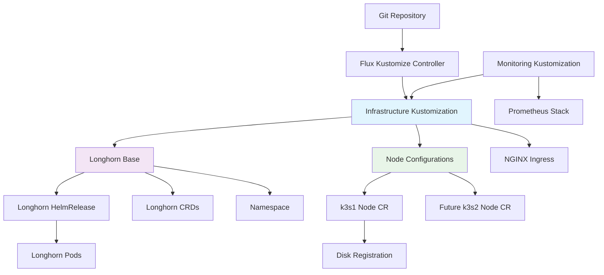

# Design Document

## Overview

This design addresses the systematic recovery and standardization of Longhorn infrastructure in the k3s-flux GitOps environment. The approach focuses on resolving namespace conflicts, establishing proper Node CR management, and ensuring reliable dependency chains while maintaining GitOps principles.

## Architecture

### Current State Analysis

The current infrastructure has several interconnected issues:

1. **Namespace Conflict**: Multiple sources define the `longhorn-system` namespace
2. **Missing Node Management**: k3s1-node-config exists but isn't applied
3. **Broken Dependencies**: Infrastructure kustomization failure blocks monitoring
4. **Incomplete Disk Configuration**: Node CRs may lack proper disk setup

### Target Architecture



## Components and Interfaces

### 1. Namespace Management Component

**Purpose**: Ensure single, authoritative namespace definition

**Design Decisions**:
- Remove namespace definition from longhorn-crd.yaml
- Keep dedicated namespace.yaml in longhorn/base/
- Remove namespace setting from kustomization.yaml to avoid conflicts

**Interface**:
```yaml
# infrastructure/longhorn/base/namespace.yaml
apiVersion: v1
kind: Namespace
metadata:
  name: longhorn-system
  labels:
    app.kubernetes.io/name: longhorn
    app.kubernetes.io/managed-by: flux
```

### 2. Longhorn Base Kustomization

**Purpose**: Clean, conflict-free resource aggregation

**Design Decisions**:
- Remove `namespace: longhorn-system` setting
- Remove `namePrefix: longhorn-` to avoid conflicts
- Keep CRDs separate from namespace-scoped resources

**Interface**:
```yaml
# infrastructure/longhorn/base/kustomization.yaml
apiVersion: kustomize.config.k8s.io/v1beta1
kind: Kustomization
resources:
  - namespace.yaml
  - helm-repository.yaml
  - helm-release.yaml
  # CRDs handled separately to avoid conflicts

commonLabels:
  app.kubernetes.io/name: longhorn
  app.kubernetes.io/managed-by: flux
```

### 3. Node Configuration Management

**Purpose**: Declarative Longhorn node and disk management

**Design Decisions**:
- Include k3s1-node-config in infrastructure kustomization
- Validate disk mounts before applying Node CRs
- Use consistent labeling and annotations

**Interface**:
```yaml
# infrastructure/kustomization.yaml (updated)
resources:
  - namespace.yaml
  - nginx-ingress/
  - longhorn/base/
  - k3s1-node-config/  # Add this
```

### 4. Dependency Chain Management

**Purpose**: Ensure proper reconciliation order

**Design Decisions**:
- Fix infrastructure kustomization first
- Monitoring waits for infrastructure readiness
- Clear error reporting and recovery paths

## Data Models

### Longhorn Node CR Structure
```yaml
apiVersion: longhorn.io/v1beta2
kind: Node
metadata:
  name: k3s1
  namespace: longhorn-system
  annotations:
    node.longhorn.io/paths: "/mnt/longhorn/sdh1"
spec:
  disks:
    sdh1:
      path: /mnt/longhorn/sdh1
      allowScheduling: true
      storageReserved: 0
      tags: []
```

### Disk Configuration Requirements
- Mount point: `/mnt/longhorn/sdh1`
- Configuration file: `/mnt/longhorn/sdh1/longhorn-disk.cfg` containing `{}`
- Permissions: Accessible by longhorn user/group
- File system: ext4 or compatible

## Error Handling

### Namespace Conflict Resolution
1. **Detection**: Kustomization build failures with duplicate resource errors
2. **Resolution**: Remove duplicate namespace definitions
3. **Validation**: Successful kustomization build
4. **Recovery**: Automatic Flux reconciliation

### Missing Node CR Recovery
1. **Detection**: No nodes.longhorn.io resources in cluster
2. **Resolution**: Include node config in infrastructure kustomization
3. **Validation**: Node CR appears and gets disk UUIDs assigned
4. **Recovery**: Volume provisioning becomes available

### Disk Configuration Validation
1. **Pre-check**: Verify mount points exist
2. **Configuration**: Ensure longhorn-disk.cfg contains valid JSON
3. **Permissions**: Validate disk access
4. **Post-check**: Confirm disk registration in Longhorn

## Testing Strategy

### Unit Testing
- Kustomization build validation
- YAML syntax and structure verification
- Resource conflict detection

### Integration Testing
- End-to-end Flux reconciliation
- Longhorn Node CR creation and disk assignment
- Volume provisioning and attachment
- Monitoring deployment after infrastructure recovery

### Validation Procedures
1. **Infrastructure Health**: `flux get kustomizations -A`
2. **Longhorn Status**: `kubectl get nodes.longhorn.io -n longhorn-system`
3. **Disk Registration**: Check Longhorn UI for disk availability
4. **Volume Testing**: Create test PVC and verify binding
5. **Monitoring Recovery**: Verify prometheus stack deployment

### Rollback Strategy
- Git-based rollback to previous working state
- Manual cleanup of stuck resources if needed
- Force reconciliation after rollback
- Validation of restored functionality

## Implementation Phases

### Phase 1: Namespace Conflict Resolution
- Clean up duplicate namespace definitions
- Update kustomization configurations
- Validate build process

### Phase 2: Node Configuration Integration
- Add k3s1-node-config to infrastructure
- Verify disk mounts and configuration
- Apply and validate Node CR creation

### Phase 3: Dependency Recovery
- Confirm infrastructure kustomization health
- Enable monitoring kustomization
- Validate end-to-end functionality

### Phase 4: Validation and Documentation
- Comprehensive testing
- Update operational procedures
- Document recovery patterns