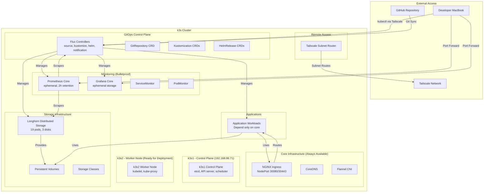
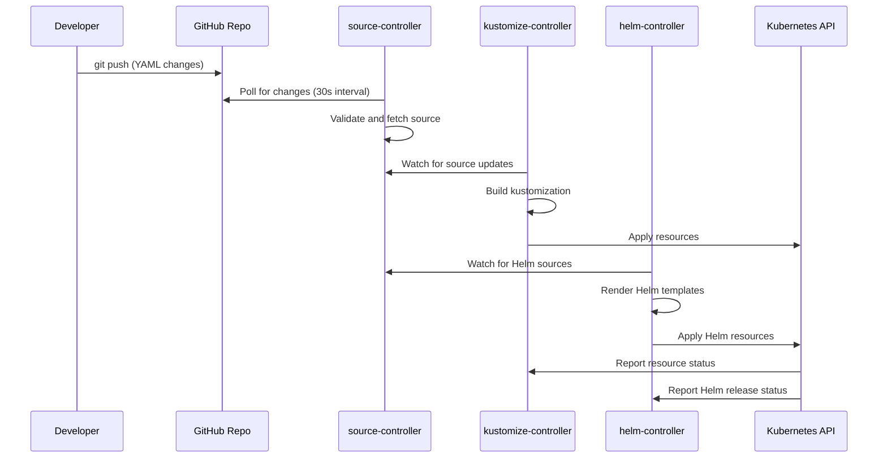
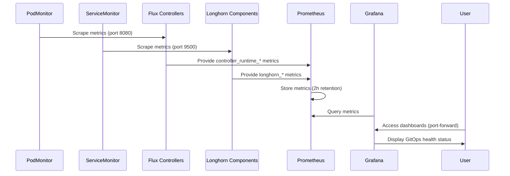
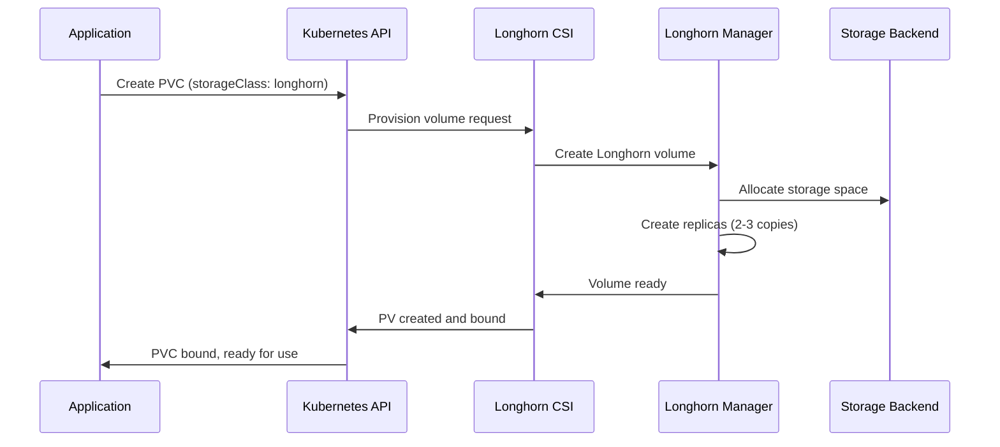

# K3s GitOps Cluster Architecture Overview

## Introduction

This document provides a comprehensive overview of the k3s GitOps cluster architecture, including component relationships, data flows, network topology, and design principles. The system is designed for resilience, maintainability, and operational excellence using GitOps patterns.

## System Overview

The cluster implements a **bulletproof architecture** where core services remain operational even during storage or component failures. This is achieved through careful dependency management and ephemeral storage strategies.



## Core Design Principles

### 1. Bulletproof Architecture
- **Core services** (networking, ingress) have no storage dependencies
- **Applications** depend only on core services, not storage
- **Storage failures** don't cascade to application availability
- **Monitoring** uses ephemeral storage to remain operational during storage issues

### 2. GitOps-First
- **Single source of truth**: All configuration in Git
- **Declarative**: Desired state defined in YAML manifests
- **Automated**: Flux reconciles cluster state continuously
- **Auditable**: All changes tracked in Git history

### 3. Resilience Patterns
- **Immutable field detection**: Prevents breaking changes before deployment
- **Automated recovery**: Error pattern detection and automated remediation
- **Health monitoring**: Comprehensive monitoring of GitOps operations
- **Emergency procedures**: Well-defined manual recovery procedures

## Component Architecture

### GitOps Control Plane (Flux CD)

**Purpose**: Manages cluster state through GitOps patterns
**Namespace**: `flux-system`
**Components**:
- `source-controller`: Manages Git repositories and Helm repositories
- `kustomize-controller`: Applies Kustomization resources
- `helm-controller`: Manages Helm releases
- `notification-controller`: Handles events and notifications

**Data Flow**:
1. Controllers watch Git repository for changes
2. Source controller fetches and validates sources
3. Kustomize/Helm controllers apply resources to cluster
4. Status is reported back to Git repository

**Dependencies**: None (core infrastructure)
**Storage**: Ephemeral (no persistent storage required)

### Storage Infrastructure (Longhorn) - ✅ IMPLEMENTATION COMPLETE

**Purpose**: Provides distributed block storage for stateful workloads
**Namespace**: `longhorn-system`
**Components**: 19 pods including managers, CSI drivers, UI, and engine images
**Status**: ✅ **Longhorn Infrastructure Recovery Complete** - Comprehensive implementation with bulletproof architecture

**Architecture**:
```
┌─────────────────────────────────────────────────────────────┐
│                    Longhorn Architecture                    │
├─────────────────────────────────────────────────────────────┤
│  Control Plane                                              │
│  ├─ longhorn-manager (DaemonSet)                           │
│  ├─ longhorn-ui (Deployment)                               │
│  └─ longhorn-driver-deployer (Deployment)                  │
│                                                             │
│  Data Plane                                                 │
│  ├─ instance-manager (manages replicas)                    │
│  ├─ engine-image (volume engines)                          │
│  └─ csi-* (Kubernetes CSI integration)                     │
│                                                             │
│  Storage Backend                                            │
│  ├─ /mnt/longhorn/sdf1 (disk 1)                           │
│  ├─ /mnt/longhorn/sdg1 (disk 2)                           │
│  └─ /mnt/longhorn/sdh1 (disk 3)                           │
└─────────────────────────────────────────────────────────────┘
```

**Key Features**:
- **Replication**: 2-3 replicas per volume across nodes
- **Snapshots**: Point-in-time volume snapshots
- **Backup**: S3-compatible backup targets
- **CSI Integration**: Kubernetes-native storage provisioning

**Dependencies**: Core infrastructure (networking)
**Managed By**: Flux HelmRelease

### Monitoring System (Bulletproof Design)

**Purpose**: Provides observability without storage dependencies
**Namespace**: `monitoring`
**Architecture**: Hybrid design with ephemeral core and optional persistent tier

```
┌─────────────────────────────────────────────────────────────┐
│                 Bulletproof Monitoring                     │
├─────────────────────────────────────────────────────────────┤
│  Core Tier (Always Available)                              │
│  ├─ Prometheus Core (emptyDir, 2h retention)               │
│  ├─ Grafana Core (ephemeral, essential dashboards)         │
│  ├─ ServiceMonitor (controllers with services)             │
│  ├─ PodMonitor (all controllers via pods)                  │
│  └─ Node/KSM exporters                                     │
│                                                             │
│  Optional Long-term Tier (Requires Longhorn)               │
│  ├─ Prometheus LT (Longhorn PVC, 30d retention)            │
│  ├─ Grafana LT (persistent dashboards)                     │
│  └─ Alertmanager                                            │
└─────────────────────────────────────────────────────────────┘
```

**Metrics Collection Strategy**:
- **Dual Collection**: Both ServiceMonitor and PodMonitor for complete Flux coverage
- **Optimized Filtering**: Reduces cardinality with targeted metric selection
- **Enhanced Labeling**: Cluster, controller, and component identification

**Dependencies**: None (core tier), Longhorn (long-term tier)
**Storage**: EmptyDir (core), PVC (long-term)

### GitOps Update Management System - 🚧 SPECIFICATION COMPLETE

**Purpose**: Provides comprehensive, automated update management for all cluster components
**Status**: 🚧 **Core Detection Infrastructure In Progress**
**Scope**: k3s, Flux controllers, Longhorn, NGINX Ingress, and all Helm charts

**Architecture**:
```
┌─────────────────────────────────────────────────────────────┐
│              GitOps Update Management System               │
├─────────────────────────────────────────────────────────────┤
│  Detection Engine                                           │
│  ├─ Component Version Scanners (k3s, Flux, Longhorn, etc.) │
│  ├─ Security Update Prioritization                         │
│  ├─ Breaking Change Analysis                               │
│  └─ Structured Report Generation                           │
│                                                             │
│  Update Orchestrator                                        │
│  ├─ Dependency-Aware Update Ordering                       │
│  ├─ Maintenance Mode Controller                            │
│  ├─ Progress Tracking & State Management                   │
│  └─ Automatic Rollback Triggers                            │
│                                                             │
│  Backup & Restore System                                   │
│  ├─ Git State Backup (commit hashes, branch states)       │
│  ├─ Configuration Backup (ConfigMaps, Secrets)             │
│  ├─ Longhorn Data Snapshots                               │
│  └─ Cluster State Export                                   │
│                                                             │
│  Validation Engine                                          │
│  ├─ Flux Controller Health Validation                      │
│  ├─ Storage Functionality Testing                          │
│  ├─ Network Connectivity Verification                      │
│  ├─ Application Health Checks                              │
│  └─ Comprehensive Pass/Fail Reporting                      │
│                                                             │
│  Impact Analysis & Audit                                   │
│  ├─ Application Dependency Mapping                         │
│  ├─ Breaking Change Detection                              │
│  ├─ Migration Recommendation Engine                        │
│  └─ Historical Audit Trails                               │
└─────────────────────────────────────────────────────────────┘
```

**Key Features**:
- **Automated Detection**: Scans all components for available updates with security prioritization
- **Safe Application**: Pre-update backups, health validation, and dependency-aware ordering
- **Comprehensive Validation**: Tests Flux, storage, networking, and application functionality
- **Reliable Rollback**: Git-based recovery with automatic validation and emergency procedures
- **Maintenance Windows**: Scheduled updates with deployment prevention and user notifications
- **Impact Analysis**: Identifies affected applications and provides migration recommendations
- **Audit Trails**: Complete logging with Git commit tracking and searchable history

**Integration Points**:
- **GitOps Resilience Patterns**: Leverages existing validation and error detection infrastructure
- **Longhorn Infrastructure**: Uses snapshot capabilities for data preservation during updates
- **Monitoring System**: Exposes update metrics and provides dashboard visualization
- **Flux Controllers**: Integrates with GitOps workflows for configuration management

**Dependencies**: GitOps Control Plane, Storage Infrastructure (for backups)
**Managed By**: Planned Flux Kustomization integration

### Network Architecture

**CNI**: Flannel (default with k3s)
**Ingress**: NGINX Ingress Controller
**Service Mesh**: None (standard Kubernetes networking)

**Network Ranges**:
- **Pod CIDR**: `10.42.0.0/16`
- **Service CIDR**: `10.43.0.0/16`
- **Host Network**: `192.168.86.0/24`
- **Tailscale**: `100.x.x.x/32` (individual IPs)

**Port Allocation**:
- **30080**: HTTP ingress (NodePort)
- **30443**: HTTPS ingress (NodePort)
- **6443**: Kubernetes API server
- **Various**: Service-specific ports

### Remote Access (Tailscale)

**Purpose**: Secure remote access without exposing ports to internet
**Namespace**: `tailscale`
**Component**: Subnet router deployment

**Architecture**:
```
┌─────────────────────────────────────────────────────────────┐
│                  Tailscale Remote Access                   │
├─────────────────────────────────────────────────────────────┤
│  MacBook (Client)                                          │
│  ├─ Tailscale client (100.117.198.6)                      │
│  ├─ kubectl with k3s-remote context                       │
│  └─ Local port forwarding                                  │
│                                                             │
│  k3s Cluster (Subnet Router)                               │
│  ├─ tailscale-subnet-router pod                            │
│  ├─ Advertises: 10.42.0.0/16, 10.43.0.0/16, 192.168.86.0/24 │
│  └─ Tailscale IP: 100.84.71.112                           │
│                                                             │
│  Access Method                                              │
│  ├─ kubectl port-forward (local) → Tailscale → cluster     │
│  ├─ Services accessible via localhost                      │
│  └─ Emergency SSH access via Tailscale IP                  │
└─────────────────────────────────────────────────────────────┘
```

**Security Features**:
- **Zero-trust**: Device-level authentication
- **Encrypted**: All traffic encrypted end-to-end
- **No exposed ports**: No internet-facing services
- **Audit logs**: Access logging in Tailscale console

## Data Flows

### GitOps Reconciliation Flow



### Monitoring Data Flow



### Storage Provisioning Flow



## Integration Points

### Flux ↔ Longhorn
- **Management**: Longhorn deployed via Flux HelmRelease
- **Dependencies**: Longhorn depends on core infrastructure
- **Monitoring**: Longhorn metrics collected by Prometheus
- **Storage**: Longhorn provides storage for applications (not core services)

### Flux ↔ Monitoring
- **Management**: Monitoring deployed via Flux Kustomization
- **Dependencies**: Core monitoring has no dependencies
- **Metrics**: Flux controllers expose metrics for Prometheus
- **Alerting**: PrometheusRules monitor Flux reconciliation health

### Applications ↔ Infrastructure
- **Networking**: Applications use NGINX Ingress for external access
- **Storage**: Applications can use Longhorn PVCs for persistence
- **Dependencies**: Applications depend only on core infrastructure
- **Isolation**: Application failures don't affect infrastructure

### Remote Access ↔ All Components
- **kubectl**: Remote kubectl access via Tailscale routing
- **Port Forwarding**: Local port forwarding through k3s-remote context
- **Monitoring**: Remote access to Prometheus and Grafana dashboards
- **Emergency**: SSH access for troubleshooting and emergency procedures

## Failure Scenarios and Resilience

### Storage Failure (Longhorn Down)
- **Impact**: Applications using persistent storage affected
- **Resilient**: Core infrastructure, monitoring, and stateless apps continue
- **Recovery**: Longhorn can be redeployed without affecting core services

### GitOps Failure (Flux Down)
- **Impact**: No new deployments or configuration changes
- **Resilient**: All running workloads continue operating
- **Recovery**: Flux controllers can be restarted without data loss

### Network Failure (Ingress Down)
- **Impact**: External access to applications affected
- **Resilient**: Internal cluster communication continues
- **Recovery**: NGINX Ingress can be redeployed quickly

### Node Failure Scenarios

#### Single Node Failure (k3s1 or k3s2 Down)
- **Impact**: Workload redistribution to healthy nodes
- **Resilient**: Multi-node setup provides high availability
- **Recovery**: Automatic pod rescheduling and storage replica failover

#### Control Plane Failure (k3s1 Down)
- **Impact**: No new deployments, existing workloads continue on k3s2
- **Mitigation**: Control plane backup and restore procedures
- **Recovery**: Node replacement with etcd restore

## Security Architecture

### Network Security
- **No exposed ports**: All external access via Tailscale
- **Encrypted communication**: Tailscale provides end-to-end encryption
- **Network policies**: Can be implemented for pod-to-pod communication
- **Ingress TLS**: HTTPS termination at NGINX Ingress

### Access Control
- **RBAC**: Kubernetes role-based access control
- **Service accounts**: Dedicated service accounts for each component
- **Secrets management**: Kubernetes secrets (SOPS planned)
- **Device authentication**: Tailscale device-level authentication

### GitOps Security
- **Git authentication**: SSH keys for repository access
- **Signed commits**: Can be enforced for critical changes
- **Branch protection**: GitHub branch protection rules
- **Audit trail**: All changes tracked in Git history

## Operational Considerations

### Backup Strategy
- **Git repository**: Primary backup (infrastructure as code)
- **Longhorn volumes**: Snapshot and backup capabilities
- **Cluster state**: Can be reconstructed from Git
- **Monitoring data**: Ephemeral by design (no backup needed)

### Scaling Considerations
- **Horizontal**: Add k3s2 node for high availability
- **Vertical**: Increase node resources as needed
- **Storage**: Add more disks to Longhorn
- **Applications**: Scale deployments based on demand

### Maintenance Windows
- **GitOps updates**: Can be applied anytime (automated)
- **Node maintenance**: Requires cluster downtime (single node)
- **Storage maintenance**: Can be performed with minimal impact
- **Monitoring updates**: Zero downtime with bulletproof design

## Future Architecture Evolution

### Planned Enhancements
- **Multi-node**: k3s2 worker node onboarding (✅ **Ready for deployment** - infrastructure complete, enhanced cloud-init prepared, comprehensive validation suite completed)
- **GitOps Update Management**: Comprehensive update management system (🚧 **Core detection infrastructure in progress** - automated detection, safe patching, validation testing, and rollback capabilities)
- **KubeVirt**: VM workloads on Kubernetes
- **Service mesh**: Istio or Linkerd for advanced networking
- **External secrets**: SOPS or External Secrets Operator
- **Additional nodes**: k3s3+ for further scaling

### Scalability Roadmap
- **Multi-cluster**: Extend GitOps patterns to multiple clusters
- **Edge computing**: Deploy to edge locations
- **Hybrid cloud**: Integration with cloud providers
- **Advanced monitoring**: Long-term metrics and alerting

## See Also

- [Implementation Plan](implementation-plan.md) - Current implementation status
- [GitOps Resilience Patterns](gitops-resilience-patterns.md) - Resilience and recovery patterns
- [GitOps Update Management](gitops-update-management.md) - Comprehensive update management system
- [Longhorn Setup](setup/longhorn-setup.md) - Storage system configuration
- [Remote Access Guide](setup/tailscale-remote-access-setup.md) - Secure remote access setup
- [Monitoring Guide](operations/monitoring-system-cleanup.md) - Bulletproof monitoring architecture
- [Troubleshooting Guide](troubleshooting/flux-recovery-guide.md) - Recovery procedures