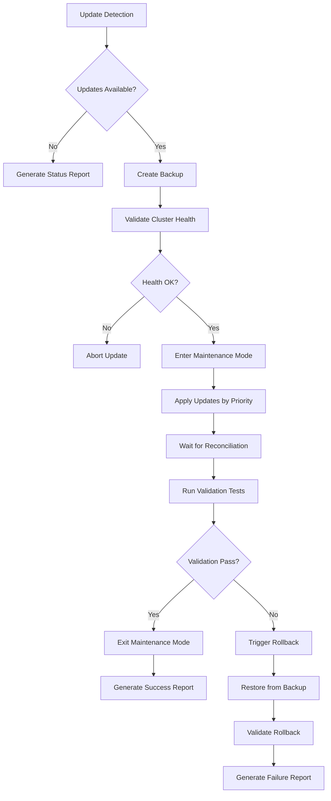

# GitOps Update Management System

## Overview

The GitOps Update Management system provides a comprehensive, automated approach to managing updates across all cluster components including k3s, Flux, Longhorn, NGINX Ingress, and Helm charts. This system ensures safe, reliable updates with automatic rollback capabilities and comprehensive validation testing.

## Features

### 🔍 Automated Update Detection ✅ **IMPLEMENTED**
- **Component Scanning**: Automatically scans for updates to k3s, Flux controllers, Longhorn, NGINX Ingress, and all Helm charts
- **Security Prioritization**: Identifies and flags critical security updates with high priority indicators
- **Unified Reporting**: Comprehensive report generation with JSON, YAML, and text output formats
- **Update History**: Tracks update scan history and maintains audit trails

#### Planned Update Detection System

The update detection system is currently in development and will provide comprehensive scanning capabilities for all cluster components when completed.
- **Structured Reporting**: Generates detailed reports showing current versions, available versions, and update criticality
- **Version Tracking**: Maintains historical version data and update patterns

### 🛡️ Safe Update Application
- **Pre-Update Backup**: Creates comprehensive backups of configurations, data, and Git state before any updates
- **Health Validation**: Validates cluster health before proceeding with updates
- **Dependency-Aware Ordering**: Follows correct update sequence (core → storage → monitoring → applications)
- **Reconciliation Waiting**: Waits for successful reconciliation before proceeding to next component
- **Automatic Rollback**: Triggers rollback procedures automatically if updates fail

### ✅ Comprehensive Validation Testing
- **Flux Controller Health**: Tests Flux controller health and reconciliation status
- **Storage Functionality**: Validates Longhorn storage with test PVC creation and mounting
- **Network Connectivity**: Verifies NGINX Ingress routing and service connectivity
- **Application Health**: Checks all deployed applications for health and responsiveness
- **Pass/Fail Reporting**: Generates detailed health reports with component-specific status

### 🔄 Reliable Rollback Procedures
- **Git-Based Recovery**: Restores previous Git commit states for affected components
- **Flux Reconciliation**: Uses Flux to reconcile back to known-good configuration states
- **Data Preservation**: Restores backed-up data and configurations in correct dependency order
- **Emergency Recovery**: Provides manual recovery procedures for critical failures
- **Rollback Validation**: Runs validation tests to confirm successful recovery

### 📅 Update Scheduling & Maintenance Windows
- **Maintenance Windows**: Configurable maintenance windows with start/end times
- **Deployment Prevention**: Prevents new deployments during maintenance mode
- **User Notifications**: Sends notifications before, during, and after maintenance windows
- **Emergency Updates**: Supports immediate update execution bypassing scheduled windows
- **Automatic Mode Exit**: Automatically exits maintenance mode after completion

### 📊 Impact Analysis & Reporting
- **Application Impact**: Identifies which applications may be affected by infrastructure changes
- **Breaking Change Detection**: Flags applications that may need configuration updates
- **API Version Analysis**: Lists resources that need manifest updates for API changes
- **Storage Impact**: Identifies applications with persistent data requiring special handling
- **Migration Recommendations**: Provides recommended actions for each affected application

### 📈 Audit Trails & History
- **Comprehensive Logging**: Logs all actions with timestamps and component versions
- **Git Commit Tracking**: Records Git commit hashes for before and after states
- **Rollback Documentation**: Documents failure reasons and recovery actions taken
- **Searchable History**: Provides searchable logs by date, component, or update type
- **Monthly Summaries**: Generates update summaries with success rates and common issues

## Architecture

### Core Components

```
GitOps Update Management System
├── Update Detection Engine
│   ├── k3s Version Scanner
│   ├── Flux Controller Scanner
│   ├── Longhorn Version Scanner
│   ├── Helm Chart Scanner
│   └── Report Generator
├── Backup & Restore System
│   ├── Git State Backup
│   ├── Configuration Backup
│   ├── Longhorn Data Backup
│   └── Cluster State Backup
├── Update Orchestrator
│   ├── Dependency Manager
│   ├── Maintenance Mode Controller
│   ├── Progress Tracker
│   └── Error Handler
├── Component Updaters
│   ├── k3s Updater
│   ├── Flux Updater
│   ├── Longhorn Updater
│   └── Helm Chart Updater
├── Validation Engine
│   ├── Flux Validator
│   ├── Storage Validator
│   ├── Network Validator
│   ├── Application Validator
│   └── Report Generator
├── Rollback Manager
│   ├── Git Rollback System
│   ├── Component Rollback
│   ├── Emergency Recovery
│   └── Validation Runner
└── Impact Analysis & Reporting
    ├── Dependency Mapper
    ├── Breaking Change Detector
    ├── Audit Logger
    └── History Tracker
```

### Update Flow



## Implementation Status

### Current Status: 🚧 Core Detection Infrastructure In Development

The GitOps Update Management system specification has been completed with comprehensive requirements and detailed implementation tasks. **Core update detection infrastructure is currently in development** with foundational components being built. Recent refinements to the implementation plan include enhanced consistency and reliability measures following established steering guidelines for API client standardization, centralized configuration management, and improved error handling patterns.

The system is designed to integrate seamlessly with the existing GitOps Resilience Patterns and build upon the proven infrastructure recovery capabilities.

### Implementation Phases

#### Phase 1: Core Infrastructure (Tasks 1-3) - 🚧 In Development
- 🚧 **Update detection framework** - Core infrastructure development in progress with enhanced reliability patterns
  - Standardized API client with consistent timeout and retry logic
  - Centralized configuration management for all detection scripts
  - Response validation and sanitization for external API calls
  - Color-coded logging patterns following steering guidelines
  - Proper module sourcing with error checking for shared libraries
  - Resource cleanup functions with trap handlers
  - k3s architecture awareness in version detection logic
  - Safe arithmetic patterns and error handling best practices
- ⏳ **Backup and restore system** - Planned
- ⏳ **Update orchestration core** - Planned

#### Phase 2: Component Integration (Tasks 4-6)
- Component-specific updaters
- Validation engine
- Rollback management

#### Phase 3: Advanced Features (Tasks 7-8)
- Impact analysis system
- Notification and monitoring integration

#### Phase 4: Testing & Documentation (Tasks 9-10)
- Comprehensive test suite
- User documentation and guides

## Integration with Existing Systems

### GitOps Resilience Patterns
- **Pre-commit Validation**: Leverages existing validation infrastructure
- **Error Pattern Detection**: Integrates with error detection system for update monitoring
- **Recovery Procedures**: Builds upon established recovery patterns

### Longhorn Infrastructure Recovery
- **Storage Backup**: Utilizes Longhorn snapshot capabilities
- **Data Preservation**: Ensures storage updates don't impact data integrity
- **Volume Migration**: Handles storage updates with zero data loss

### Monitoring Integration
- **Prometheus Metrics**: Exposes update process metrics
- **Grafana Dashboards**: Provides update history and success rate visualization
- **Alert Rules**: Notifies on update failures and rollback events

## Security Considerations

### Backup Security
- **Encrypted Storage**: All backups encrypted at rest
- **Access Control**: Restricted access to backup systems
- **Integrity Validation**: Backup integrity checks before restore

### Update Validation
- **Signature Verification**: Validates component signatures before installation
- **Rollback Testing**: Tests rollback procedures regularly
- **Emergency Procedures**: Secure emergency access for critical failures

## Future Enhancements

### Planned Features
- **Blue-Green Deployments**: Zero-downtime update strategies
- **Canary Updates**: Gradual rollout with automatic rollback
- **Multi-Cluster Updates**: Coordinated updates across cluster environments
- **AI-Powered Analysis**: Machine learning for update impact prediction

### Integration Opportunities
- **CI/CD Pipeline Integration**: Automated update testing in development environments
- **Compliance Reporting**: Automated compliance reports for update management
- **Cost Analysis**: Update cost tracking and optimization recommendations

## Getting Started

### Prerequisites
- Existing k3s cluster with Flux GitOps
- GitOps Resilience Patterns implemented
- Longhorn Infrastructure Recovery operational
- Monitoring stack deployed

### Implementation Roadmap
1. Review the [GitOps Update Management Spec](.kiro/specs/gitops-update-management/)
2. Follow the detailed [Implementation Tasks](.kiro/specs/gitops-update-management/tasks.md)
3. Test in development environment before production deployment
4. Configure maintenance windows and notification preferences

### Support and Documentation
- **Specification**: [Requirements](.kiro/specs/gitops-update-management/requirements.md) and [Tasks](.kiro/specs/gitops-update-management/tasks.md)
- **Architecture**: [GitOps Resilience Patterns](gitops-resilience-patterns.md)
- **Infrastructure**: [Longhorn Infrastructure Recovery](longhorn-infrastructure-recovery-completion.md)
- **Troubleshooting**: [Flux Recovery Guide](troubleshooting/flux-recovery-guide.md)

---

*This system represents the next evolution in GitOps automation, providing enterprise-grade update management capabilities for Kubernetes infrastructure. The comprehensive approach ensures reliability, security, and operational excellence in cluster maintenance.*