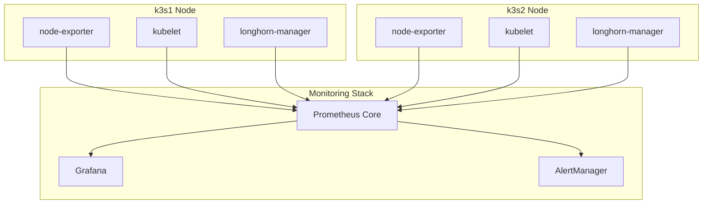

# k3s2 Node Monitoring Integration

## Overview

This document describes the implementation of comprehensive monitoring integration for the k3s2 worker node, including enhanced ServiceMonitors, PodMonitors, Grafana dashboards, and alerting rules.

## Implementation Summary

### 1. Enhanced ServiceMonitor and PodMonitor Configuration

**File: `infrastructure/monitoring/core/multi-node-servicemonitor.yaml`**

- **Multi-Node ServiceMonitor**: Monitors node-exporter services across both k3s1 and k3s2
- **Multi-Node Kubelet PodMonitor**: Collects kubelet metrics from both nodes
- **Multi-Node Kube-Proxy ServiceMonitor**: Monitors kube-proxy services on both nodes

Key features:
- Automatic node role identification (control-plane vs worker)
- Node tier labeling (primary vs expansion)
- Cluster-wide metric collection with proper labeling
- Optimized metric filtering to reduce cardinality

### 2. k3s2-Specific Grafana Dashboard

**File: `infrastructure/monitoring/core/k3s2-node-dashboard.yaml`**

Dashboard panels include:
- **Node Status**: Real-time k3s2 availability indicator
- **Resource Gauges**: CPU, Memory, and Disk usage with thresholds
- **Multi-Node Comparisons**: Side-by-side resource usage charts
- **Longhorn Storage Status**: k3s2 storage health and capacity
- **Pod Distribution**: Number of pods running on k3s2
- **Network Traffic**: k3s2 network interface monitoring

### 3. Multi-Node Cluster Overview Dashboard

**File: `infrastructure/monitoring/core/multi-node-cluster-dashboard.yaml`**

Comprehensive cluster-wide view:
- **Cluster Status**: Both node availability at a glance
- **Resource Comparisons**: CPU and Memory usage across nodes
- **Pod Distribution**: Visual representation of workload balance
- **Storage Comparison**: Longhorn capacity and usage across nodes

### 4. k3s2-Specific Alerting Rules

**File: `infrastructure/monitoring/core/k3s2-node-alerts.yaml`**

#### Critical Alerts
- **K3s2NodeDown**: Node unreachable for >1 minute
- **K3s2LonghornStorageDown**: Storage unavailable for >2 minutes
- **K3s2NodeNotReady**: Kubernetes node not ready for >2 minutes

#### Warning Alerts
- **K3s2NodeHighCPU**: CPU usage >80% for >5 minutes
- **K3s2NodeHighMemory**: Memory usage >85% for >5 minutes
- **K3s2NodeHighDiskUsage**: Disk usage >85% for >5 minutes
- **K3s2NodeTooManyPods**: Pod count >100 for >5 minutes
- **K3s2NetworkConnectivityIssue**: Network errors detected

#### Informational Alerts
- **K3s2WorkloadImbalance**: Uneven pod distribution between nodes

#### Recording Rules
- `k3s2:node_health_score`: Composite health metric
- `k3s2:resource_utilization_percent`: Overall resource usage
- `k3s2:pod_count`: Current pod count on k3s2
- `k3s2:storage_utilization_percent`: Storage usage percentage

### 5. Enhanced Prometheus Configuration

**Updated: `infrastructure/monitoring/core/prometheus-core.yaml`**

Enhanced scrape configurations:
- **Multi-node Longhorn monitoring** with node identification
- **Multi-node kubelet metrics** with HTTPS and proper authentication
- **Node role labeling** for k3s1 (control-plane) and k3s2 (worker)
- **Cluster-wide labeling** for multi-cluster identification

### 6. Updated Grafana Configuration

**Updated: `infrastructure/monitoring/core/grafana-core.yaml`**

Dashboard integration:
- Added "Node Monitoring" folder for node-specific dashboards
- Integrated k3s2-specific dashboard
- Added multi-node cluster overview dashboard
- Configured dashboard providers for proper organization

## Monitoring Architecture

### Metric Collection Flow



### Dashboard Organization

- **Default Folder**: General cluster dashboards
- **Node Monitoring Folder**: Node-specific dashboards
  - k3s2 Node Monitoring Dashboard
  - Multi-Node Cluster Overview
- **Longhorn Folder**: Storage-specific dashboards
- **Flux Folder**: GitOps monitoring dashboards

### Alert Routing

All k3s2-specific alerts include labels:
- `component: k3s2-node|k3s2-storage|k3s2-network|k3s2-workload`
- `node: k3s2`
- `severity: critical|warning|info`
- `pattern: <specific-pattern>`

## Requirements Fulfillment

### ✅ 5.1: Update monitoring configurations to include k3s2 node metrics
- Enhanced ServiceMonitor and PodMonitor configurations
- Multi-node kubelet and kube-proxy monitoring
- Comprehensive metric collection with proper labeling

### ✅ 5.2: Enhance Prometheus ServiceMonitor and PodMonitor for multi-node setup
- Created `multi-node-servicemonitor.yaml` with comprehensive coverage
- Enhanced Prometheus scrape configurations
- Proper node role and tier identification

### ✅ 5.3: Create k3s2-specific Grafana dashboard panels
- Dedicated k3s2 node monitoring dashboard
- Multi-node cluster overview dashboard
- Resource usage comparisons and storage monitoring

### ✅ 5.4: Implement alerting rules for k3s2 node health monitoring
- Comprehensive alerting rules for all critical scenarios
- Recording rules for health scoring and metrics
- Proper alert routing and severity classification

## Deployment

The monitoring integration is automatically deployed when k3s2 joins the cluster:

1. **ServiceMonitors and PodMonitors** automatically discover k3s2 endpoints
2. **Prometheus** begins collecting metrics from k3s2 services
3. **Grafana dashboards** display k3s2 metrics in real-time
4. **Alert rules** monitor k3s2 health and trigger notifications

## Verification

After k3s2 joins the cluster, verify monitoring integration:

```bash
# Check Prometheus targets
kubectl port-forward -n monitoring svc/monitoring-core-prometheus-prometheus 9090:9090 &
curl -s http://localhost:9090/api/v1/targets | jq '.data.activeTargets[] | select(.labels.instance | contains("k3s2"))'

# Check Grafana dashboards
kubectl port-forward -n monitoring svc/monitoring-core-grafana 3000:80 &
# Navigate to http://localhost:3000 and check "Node Monitoring" folder

# Verify alerting rules
kubectl get prometheusrules -n monitoring k3s2-node-alerts -o yaml
```

## Troubleshooting

### Common Issues

1. **k3s2 metrics not appearing**: Check ServiceMonitor selectors and node labels
2. **Dashboard panels empty**: Verify Prometheus target discovery
3. **Alerts not firing**: Check PrometheusRule deployment and expression syntax
4. **Storage metrics missing**: Ensure Longhorn is properly configured on k3s2

### Debug Commands

```bash
# Check ServiceMonitor status
kubectl get servicemonitor -n monitoring multi-node-monitoring -o yaml

# Check Prometheus configuration
kubectl get prometheus -n monitoring monitoring-core-prometheus -o yaml

# Check alert rules
kubectl get prometheusrules -n monitoring -o wide

# Check Grafana dashboard ConfigMaps
kubectl get configmap -n monitoring -l grafana_dashboard=1
```

This implementation provides comprehensive monitoring coverage for k3s2 node integration while maintaining the bulletproof architecture principles of the k3s-flux cluster.