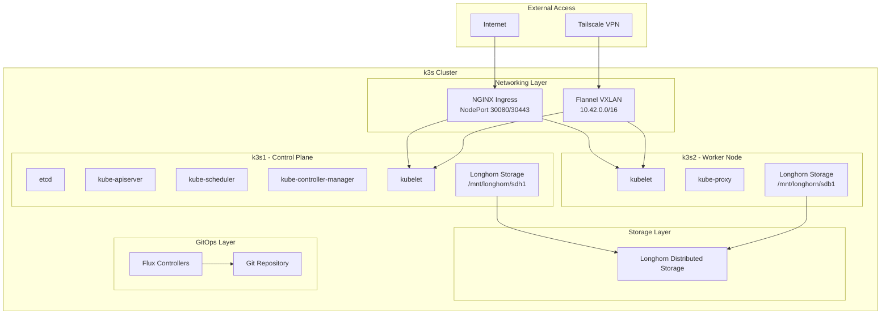
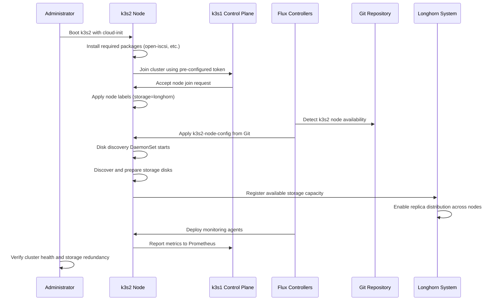

# Multi-Node Cluster Expansion Guide

This guide covers expanding the k3s cluster from a single control plane node (k3s1) to a multi-node setup by adding worker nodes, starting with k3s2. The expansion maintains the bulletproof architecture principles where core infrastructure remains operational even during storage failures.

## Table of Contents
1. [Overview](#overview)
2. [Prerequisites](#prerequisites)
3. [Architecture](#architecture)
4. [Node Preparation](#node-preparation)
5. [Automated Onboarding](#automated-onboarding)
6. [Manual Onboarding](#manual-onboarding)
7. [Verification](#verification)
8. [Troubleshooting](#troubleshooting)
9. [Rollback Procedures](#rollback-procedures)

## Overview

### Current State
- **k3s1**: Control plane node (192.168.86.71) with Longhorn storage
- **Single-node cluster**: All workloads running on k3s1
- **Bulletproof architecture**: Core services independent of storage layer
- **k3s2 Infrastructure**: GitOps configuration ready, enhanced cloud-init prepared with comprehensive error handling and health monitoring

### Target State
- **k3s1**: Control plane node (continues existing role)
- **k3s2**: Worker node with distributed storage participation
- **Multi-node cluster**: Workloads distributed across nodes
- **Storage redundancy**: Longhorn replicas across multiple nodes

### Benefits of Multi-Node Setup
- **High Availability**: Workload distribution across nodes
- **Storage Redundancy**: Multiple replicas for data protection
- **Performance**: Load distribution and parallel processing
- **Scalability**: Foundation for additional node expansion

## Prerequisites

### Hardware Requirements
- **k3s2 Node**: Minimum 2 CPU cores, 4GB RAM, 20GB storage
- **Network**: Same subnet as k3s1 (192.168.86.0/24)
- **Storage**: Additional disk for Longhorn (recommended: separate disk)

### Software Requirements
- **Operating System**: Ubuntu 20.04+ or compatible Linux distribution
- **Network Access**: Connectivity to k3s1:6443 (Kubernetes API)
- **Internet Access**: For package installation and k3s download

### Cluster Prerequisites
- **k3s1 Healthy**: Control plane node operational
- **Flux Operational**: GitOps system functioning
- **Pre-Onboarding Validation**: Run comprehensive validation before proceeding

#### Pre-Onboarding Validation
Before adding k3s2, validate cluster readiness using the comprehensive validation script:

```bash
# Run comprehensive pre-onboarding validation
./scripts/k3s2-pre-onboarding-validation.sh --report

# Individual validation modules (if needed)
./scripts/cluster-readiness-validation.sh
./scripts/network-connectivity-verification.sh
./scripts/storage-health-check.sh
./scripts/monitoring-validation.sh
```

The validation script checks:
- ✅ **Cluster Health**: Control plane and API server status
- ✅ **Network Configuration**: CIDR ranges and CNI functionality
- ✅ **Storage System**: Longhorn health and expansion readiness
- ✅ **Monitoring Infrastructure**: Prometheus and Grafana functionality
- ✅ **GitOps Operations**: Flux controllers and reconciliation health

**Proceed only if all validations pass.** Address any issues before continuing with node onboarding.
- **Storage System**: Longhorn deployed and healthy
- **Monitoring**: Core monitoring tier operational

### Verification Commands
```bash
# Verify k3s1 cluster health
kubectl cluster-info
kubectl get nodes -o wide
flux check

# Verify storage system
kubectl get pods -n longhorn-system
kubectl get volumes -n longhorn-system

# Check monitoring system
kubectl get pods -n monitoring
```

## Architecture

### Multi-Node Cluster Architecture



### Node Onboarding Flow



## Node Preparation

### 1. Physical/Virtual Machine Setup
- **CPU**: 2+ cores recommended
- **RAM**: 4GB+ recommended  
- **Storage**: Primary disk + additional disk for Longhorn
- **Network**: Static IP or DHCP reservation recommended

### 2. Operating System Installation
Install Ubuntu 20.04+ or compatible Linux distribution with:
- SSH access enabled
- Network connectivity configured
- User with sudo privileges

### 3. Network Configuration
Ensure k3s2 can reach k3s1:
```bash
# Test connectivity to k3s1
ping 192.168.86.71
telnet 192.168.86.71 6443
```

### 4. Storage Preparation (Optional)
If using a dedicated disk for Longhorn:
```bash
# Identify available disks
lsblk
fdisk -l

# The disk discovery DaemonSet will handle formatting
# No manual preparation needed
```

## Automated Onboarding

The recommended approach uses cloud-init for fully automated node onboarding.

### 1. Prepare Cloud-Init Configuration

The cloud-init configuration is already prepared at `infrastructure/cloud-init/user-data.k3s2` with enhanced features:

**Enhanced Features (Recently Added):**
- **Comprehensive Error Handling**: Retry mechanisms for k3s installation and cluster join operations
- **Health Monitoring**: Real-time status tracking with HTTP endpoint on port 8080
- **Detailed Logging**: Comprehensive logging to `/opt/k3s-onboarding/onboarding.log`
- **Status Tracking**: JSON status file at `/opt/k3s-onboarding/status.json` with step-by-step progress
- **Validation Steps**: Pre-installation connectivity validation and post-installation verification
- **Automatic Recovery**: Built-in retry logic for transient failures

**Configuration Overview:**

```yaml
#cloud-config

hostname: k3s2
preserve_hostname: true

packages:
  - open-iscsi
  - jq
  - curl
  - wget

runcmd:
  # Enable iscsid (required for Longhorn)
  - systemctl enable --now iscsid
  
  # Install k3s and join cluster
  - curl -sfL https://get.k3s.io | K3S_URL=https://192.168.86.71:6443 K3S_TOKEN=<cluster-token> sh -
  
  # Label node for Longhorn
  - KUBECONFIG=/etc/rancher/k3s/k3s.yaml kubectl label node $(hostname) node.longhorn.io/create-default-disk=config
  - KUBECONFIG=/etc/rancher/k3s/k3s.yaml kubectl label node $(hostname) storage=longhorn
```

### 2. Deploy with Cloud-Init

#### Using Cloud Provider
If using a cloud provider (AWS, GCP, Azure, etc.):
1. Use the cloud-init configuration during VM creation
2. The node will automatically join the cluster
3. Proceed to [GitOps Activation](#3-gitops-activation)

#### Using Local Virtualization
For local VMs (Proxmox, VMware, etc.):
1. Create VM with cloud-init support
2. Apply the user-data configuration
3. Boot the VM

### 3. Monitor Onboarding Progress

The enhanced cloud-init configuration provides real-time monitoring:

```bash
# Monitor onboarding status via HTTP endpoint
curl http://<k3s2-ip>:8080

# View detailed logs
ssh k3s2 "tail -f /opt/k3s-onboarding/onboarding.log"

# Check status file
ssh k3s2 "cat /opt/k3s-onboarding/status.json | jq"
```

**Status Indicators:**
- `packages_installed`: Required packages installed
- `iscsi_enabled`: iSCSI daemon enabled for Longhorn
- `k3s_installed`: k3s agent installed successfully
- `cluster_joined`: Node joined cluster and is Ready
- `node_labeled`: Longhorn labels applied
- `health_check_ready`: Overall onboarding completed

### 4. GitOps Activation

The k3s2 configuration is already activated in the storage kustomization. Flux will automatically apply the k3s2 node configuration once the node joins:

```bash
# Verify GitOps configuration is active
grep -A 5 "k3s2-node-config" infrastructure/storage/kustomization.yaml

# Monitor Flux reconciliation
flux get kustomizations infrastructure-storage

# Check k3s2 node configuration application
kubectl get longhornnode k3s2 -n longhorn-system
```

## Manual Onboarding

If cloud-init is not available, follow these manual steps.

### 1. Install Prerequisites

```bash
# Update system
sudo apt update && sudo apt upgrade -y

# Install required packages
sudo apt install -y open-iscsi jq curl wget

# Enable iSCSI daemon
sudo systemctl enable --now iscsid
```

### 2. Join k3s Cluster

```bash
# Get cluster token from k3s1
# On k3s1:
sudo cat /var/lib/rancher/k3s/server/node-token

# On k3s2, join the cluster:
curl -sfL https://get.k3s.io | K3S_URL=https://192.168.86.71:6443 K3S_TOKEN=<cluster-token> sh -
```

### 3. Label Node for Longhorn

```bash
# Set KUBECONFIG
export KUBECONFIG=/etc/rancher/k3s/k3s.yaml

# Label node for Longhorn
kubectl label node k3s2 node.longhorn.io/create-default-disk=config
kubectl label node k3s2 storage=longhorn
```

### 4. Activate GitOps Configuration

Follow the same GitOps activation steps as in the automated section.

## Verification

### 1. Verify Node Status

```bash
# Check node status
kubectl get nodes -o wide

# Expected output:
# NAME   STATUS   ROLES                  AGE   VERSION
# k3s1   Ready    control-plane,master   30d   v1.24.x
# k3s2   Ready    <none>                 5m    v1.24.x
```

### 2. Verify Flux Reconciliation

```bash
# Check Flux status
flux get kustomizations -A

# Check storage kustomization specifically
kubectl get kustomization infrastructure-storage -n flux-system -o yaml
```

### 3. Verify Longhorn Integration

```bash
# Check Longhorn nodes
kubectl get longhornnode -n longhorn-system

# Check disk discovery
kubectl get pods -n longhorn-system -l app=disk-discovery

# Verify storage capacity
kubectl get nodes -o jsonpath='{.items[*].status.capacity.storage}'
```

### 4. Verify Storage Distribution

```bash
# Create test PVC
kubectl apply -f - <<EOF
apiVersion: v1
kind: PersistentVolumeClaim
metadata:
  name: multi-node-test
  namespace: default
spec:
  accessModes:
    - ReadWriteOnce
  storageClassName: longhorn
  resources:
    requests:
      storage: 1Gi
EOF

# Check volume replicas
kubectl get volumes -n longhorn-system
kubectl describe volume <volume-name> -n longhorn-system

# Cleanup
kubectl delete pvc multi-node-test
```

### 5. Verify Monitoring Integration

```bash
# Check node-exporter on k3s2
kubectl get pods -n monitoring -l app.kubernetes.io/name=node-exporter -o wide

# Verify metrics collection
kubectl port-forward -n monitoring svc/monitoring-core-prometheus-kube-prom-prometheus 9090:9090 &
# Visit http://localhost:9090 and query: up{instance=~".*k3s2.*"}
```

### 6. Test Application Distribution

```bash
# Scale example application
kubectl scale deployment example-app --replicas=4

# Check pod distribution
kubectl get pods -o wide | grep example-app

# Verify pods are scheduled on both nodes
```

## Troubleshooting

### Node Join Issues

#### Problem: k3s2 fails to join cluster
```bash
# Check k3s agent status
sudo systemctl status k3s-agent

# Check logs
sudo journalctl -u k3s-agent -f

# Common solutions:
# 1. Verify network connectivity to k3s1:6443
# 2. Check cluster token validity
# 3. Ensure firewall allows traffic
# 4. Verify time synchronization
```

#### Problem: Node shows NotReady status
```bash
# Check node conditions
kubectl describe node k3s2

# Check kubelet logs
sudo journalctl -u k3s-agent -f

# Common causes:
# - CNI plugin issues
# - Resource constraints
# - Disk pressure
```

### Storage Integration Issues

#### Problem: Longhorn doesn't detect k3s2
```bash
# Check node labels
kubectl get node k3s2 --show-labels

# Verify iSCSI daemon
sudo systemctl status iscsid

# Check Longhorn manager logs
kubectl logs -n longhorn-system -l app=longhorn-manager
```

#### Problem: Disk discovery fails
```bash
# Check disk discovery DaemonSet
kubectl get pods -n longhorn-system -l app=disk-discovery

# Check available disks
lsblk
df -h

# Manual disk preparation if needed
sudo mkdir -p /mnt/longhorn/sdb1
sudo mount /dev/sdb1 /mnt/longhorn/sdb1
```

### GitOps Issues

#### Problem: k3s2 configuration not applied
```bash
# Check Flux reconciliation
flux get kustomizations infrastructure-storage

# Force reconciliation
flux reconcile kustomization infrastructure-storage

# Check for errors
kubectl describe kustomization infrastructure-storage -n flux-system
```

### Network Issues

#### Problem: Pod-to-pod communication fails
```bash
# Test pod network
kubectl run test-pod --image=busybox --rm -it -- /bin/sh
# Inside pod: ping <other-pod-ip>

# Check Flannel status
kubectl get pods -n kube-system -l app=flannel

# Verify VXLAN interface
ip link show flannel.1
```

### Monitoring Issues

#### Problem: k3s2 metrics not appearing
```bash
# Check node-exporter DaemonSet
kubectl get pods -n monitoring -l app.kubernetes.io/name=node-exporter

# Verify ServiceMonitor/PodMonitor
kubectl get servicemonitor,podmonitor -n monitoring

# Check Prometheus targets
kubectl port-forward -n monitoring svc/monitoring-core-prometheus-kube-prom-prometheus 9090:9090 &
# Visit http://localhost:9090/targets
```

## Rollback Procedures

### Emergency Node Removal

If k3s2 causes issues and needs to be removed:

#### 1. Drain Node
```bash
# Gracefully drain workloads
kubectl drain k3s2 --ignore-daemonsets --delete-emptydir-data --force

# Wait for pods to reschedule
kubectl get pods -A -o wide | grep k3s2
```

#### 2. Remove from Longhorn
```bash
# Disable scheduling on k3s2 in Longhorn UI
# Or via kubectl:
kubectl patch longhornnode k3s2 -n longhorn-system --type='merge' -p='{"spec":{"allowScheduling":false}}'

# Wait for replicas to migrate
kubectl get volumes -n longhorn-system
```

#### 3. Remove Node from Cluster
```bash
# Delete node from cluster
kubectl delete node k3s2
```

#### 4. Deactivate GitOps Configuration
```bash
# Comment out k3s2-node-config in storage kustomization
vim infrastructure/storage/kustomization.yaml

# Commit changes
git add infrastructure/storage/kustomization.yaml
git commit -m "rollback: deactivate k3s2 node configuration"
git push
```

#### 5. Clean Up k3s2 Node
```bash
# On k3s2 node:
sudo /usr/local/bin/k3s-agent-uninstall.sh

# Clean up storage mounts
sudo umount /mnt/longhorn/sdb1
sudo rm -rf /mnt/longhorn/
```

### Partial Rollback

If only storage integration needs to be rolled back:

```bash
# Remove k3s2 from Longhorn only
kubectl patch longhornnode k3s2 -n longhorn-system --type='merge' -p='{"spec":{"allowScheduling":false}}'

# Comment out k3s2-node-config
# Node remains in cluster but doesn't participate in storage
```

## Next Steps

After successful k3s2 onboarding:

1. **Monitor Performance**: Observe cluster performance and resource utilization
2. **Test Failover**: Simulate node failures to verify high availability
3. **Plan Additional Nodes**: Consider adding more worker nodes for further scaling
4. **Backup Strategy**: Update backup procedures for multi-node setup
5. **Security Review**: Ensure security policies apply to all nodes

## See Also

- [Architecture Overview](../architecture-overview.md) - Complete system architecture
- [Longhorn Setup](longhorn-setup.md) - Storage system configuration
- [Monitoring Guide](../guides/monitoring-user-guide.md) - Multi-node monitoring
- [Troubleshooting Guide](../troubleshooting/flux-recovery-guide.md) - Recovery procedures
- [k3s2 Node Onboarding Spec](../../.kiro/specs/k3s1-node-onboarding/) - Detailed implementation plan